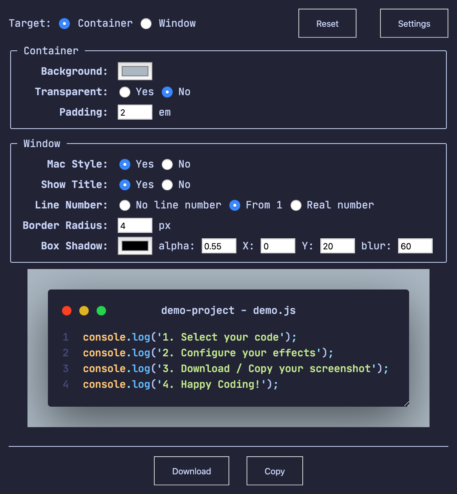
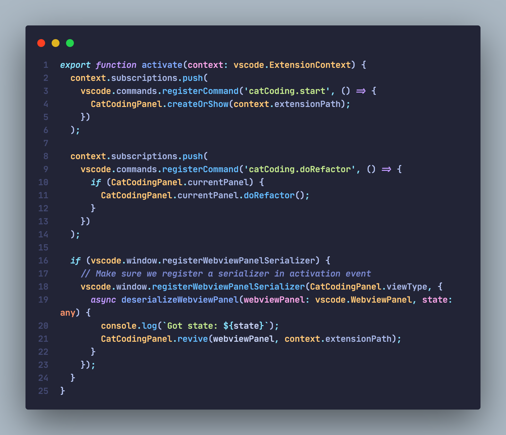
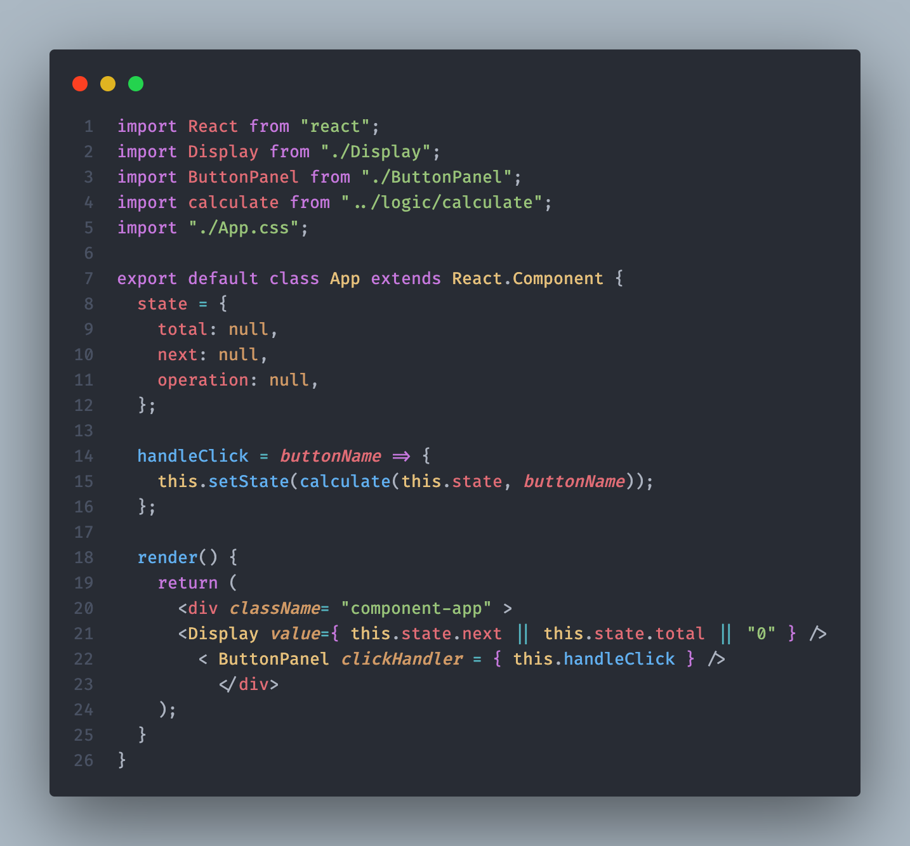
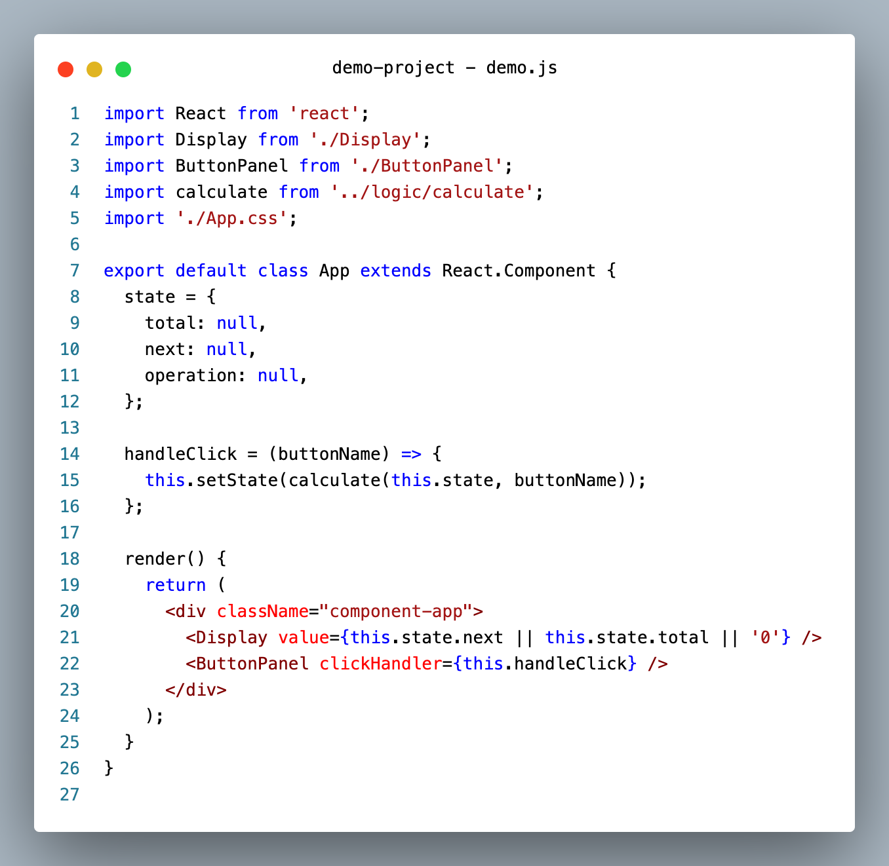

# ColdCode

An easy and configurable way to take screenshots of your elegant code.

## Features

- Realtime configuration, realtime effects
- Download as `png`/`svg` file or Copy to your clipboard
- Show line numbers (From 1 or real line number)
- Show title and customize title
- Many other configuration options

## Usage

1. Open the command palette (Ctrl+Shift+P on Windows and Linux, Cmd+Shift+P on OS X) and search for `ColdCode`.
2. Select the code you'd like to screenshot.
3. Configure the screenshot in realtime.
4. Click the 'Download' button to save the screenshot to your disk.
5. Or click the 'Copy' button to save the screenshot to your clipboard.

## Tips

- You can also start ColdCode by selecting code, right clicking, and clicking ColdCode
- Resize the snippet window by dragging the lowerright corner
- "RESET" the configuration to default if you mess it up

## Demo / Screenshot

**Configuration Page**

[Moonlight II Italic](https://github.com/atomiks/moonlight-vscode-theme) + [Jetbrans Mono](https://www.jetbrains.com/lp/mono/)

[OneDark Pro](https://marketplace.visualstudio.com/items?itemName=zhuangtongfa.Material-theme) + [FiraCode](https://github.com/tonsky/FiraCode)

Light (Visual Studio) + Menlo

## Credit

Thanks to [dom-to-image](https://github.com/tsayen/dom-to-image) for generating the images from dom.

Thanks to [dom-to-svg](https://github.com/felixfbecker/dom-to-svg) for generating the svgs from dom.

Thanks to [Polacode](https://github.com/octref/polacode) that inspired Coldcode.

Thanks to [CodeSnap](https://github.com/kufii/CodeSnap) that inspired me many ideas.

## Contribution

Contribution is not very welcome. Please open an issue first so I can stop you from complicating the UX.

## License

MIT

---

**Happy Coding!**
